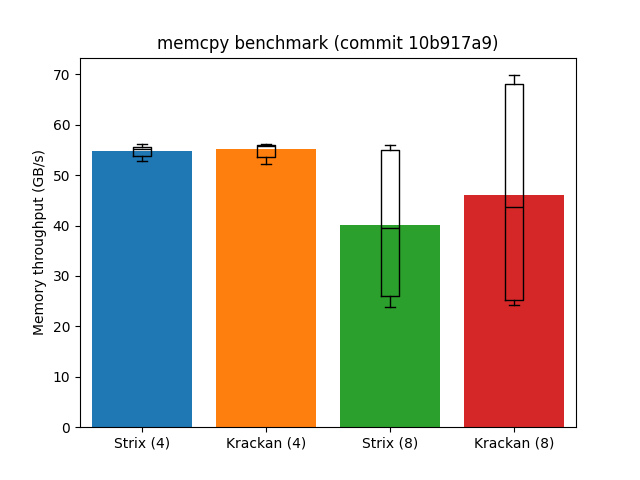
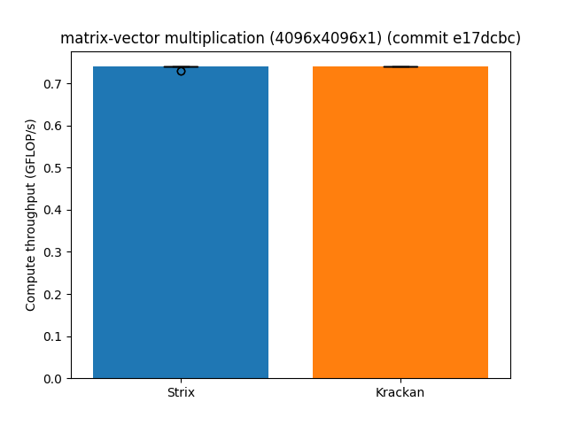

# Memory Bandwidth / GEMV Performance

## `memcpy`

Benchmarked commit: `b9b700e`
 
Benchmarked commands:
```
make run length=16777216 cols=4 chans=2 bypass=True
for i in $(seq 100); do ./memcpy.exe -x build/final.xclbin -i build/insts.bin -k MLIR_AIE -l 16777216 >> res_4col.txt; done
make run length=16777216 cols=8 chans=2 bypass=True
for i in $(seq 100); do ./memcpy.exe -x build/final.xclbin -i build/insts.bin -k MLIR_AIE -l 16777216 >> res_8col.txt; done
```

Results:
```
Strix (4): 26.16 GB/s
Krackan (4): 25.36 GB/s
Strix (8): 25.65 GB/s
Krackan (8): 25.21 GB/s
```



`(8)` vs `(4)` denotes number of columns used.

## GEMV

Benchmarked commit: `e17dcbc`

Benchmarked command:
```
make run
for i in $(seq 100); do ./matrix_vector.exe -x build/final_4096x4096x1.xclbin -i build/insts_4096x4096x1.txt -k MLIR_AIE -M 4096 -K 4096 -N 1 -v 2 --warmup 20 --iters 2 >> res.txt; done
```

Results:
```
Strix: 0.74 GFLOP/s
Krackan: 0.74 GFLOP/s
```



## Strix System Configuration
* Configured into turbo `--pmode`. 

```
System Configuration
  OS Name              : Linux
  Release              : 6.14.0-27-generic
  Machine              : x86_64
  CPU Cores            : 24
  Memory               : 27651 MB
  Distribution         : Ubuntu 24.04.1 LTS
  GLIBC                : 2.39
  Model                : SER9
  BIOS Vendor          : American Megatrends International, LLC.
  BIOS Version         : STX.3xx.SER9.V103.P8C0M0C15.55.Link.GID.90

XRT
  Version              : 2.20.41
  Branch               : HEAD
  Hash                 : 3323da80ff4def061862e463b2b8f13a98e8c639
  Hash Date            : 2025-07-02 19:03:45
  amdxdna              : 2.20.250102.3.rel_20250702, a0f5acc5efe3eb72a4bf917106494bd05c6d0e95
  virtio-pci           : unknown, unknown
  NPU Firmware Version : 1.0.18.3

Device(s) Present
|BDF             |Name       |
|----------------|-----------|
|[0000:65:00.1]  |NPU Strix  |

```
```
aie-opt 37a64106110ef79c0fbe7408b66242dd3af028e9
```

## Krackan System Configuration
* Configured into turbo `--pmode`. 

```
$ xrt-smi examine
System Configuration
  OS Name              : Linux
  Release              : 6.14.0-27-generic
  Machine              : x86_64
  CPU Cores            : 16
  Memory               : 95566 MB
  Distribution         : Ubuntu 24.04 LTS
  GLIBC                : 2.39
  Model                : 4X4 BOX-AI350
  BIOS Vendor          : American Megatrends International, LLC.
  BIOS Version         : P1.10

XRT
  Version              : 2.20.0
  Branch               : HEAD
  Hash                 : a62adc1020c901af79529457c46f210aa05f15a3
  Hash Date            : 2025-08-13 16:59:47
  amdxdna              : 2.20.0_20250813, e9d2788a884784e3531e95d65b923c2252a1132e
  virtio-pci           : unknown, unknown
  NPU Firmware Version : 255.0.2.7

Device(s) Present
|BDF             |Name         |
|----------------|-------------|
|[0000:e6:00.1]  |NPU Krackan  |
```
```
aie-opt 65b08687eaeaa0006141c0b3cc0e7abe359e2f38
```
